# Thesis Summary: Radiation Properties in Wendelstein-7X Stellarator

## Chapter 0: Introduction

### Nuclear Fusion Overview
- **Motivation**: Clean, renewable energy alternative to fossil fuels addressing climate change and energy consumption
- **DT Fusion Reaction**: Deuterium-Tritium fusion is most advantageous at energies ≤64 keV
  - Equation: ²₁D + ³₁T → ⁵₂He* → ⁴₂He (3.5 MeV) + ¹₀n (14.1 MeV)
  - Plasma temperatures of 20 keV regularly achieved
  - Fast neutrons used for heating water repository in future power plants
  - Minimal radioactive waste from neutron activation
  - Deuterium abundant in water; Tritium bred using Lithium blanket

### Wendelstein 7-X (W7-X)

- **History**: Latest iteration of stellarator experiments at Max-Planck Institute (first W1-A in 1960)
- **Design Features**:
  - Modular, five-fold symmetric design
  - 70 superconducting magnets (7 different shapes)
  - 50 non-planar coils (twisted magnetic field) + 20 planar coils (flexibility)
  - Major radius: 5.5 m, Minor radius: 0.53 m
  - Volume: 30 m³
  - Maximum magnetic field: 3 T
  - Heating power: 14 MW
  - Expected plasma temperatures: up to 130 MK
  - Goal: 30-minute discharge at 10 MW (continuous operation)

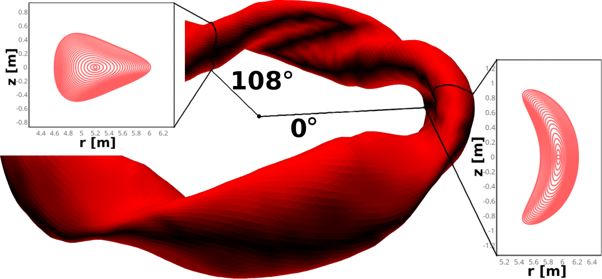

- **Magnetic Configuration**:
  - Stellarators generate rotational transform via external coils (vs tokamaks)
  - Optimized to minimize: magnetic islands, neoclassical transport, bootstrap current
  - Maximize: plasma equilibrium, MHD stability, fast particle confinement
  - Five field periods, stellarator symmetric
  - Island divertor concept at edge resonances (ι ≈ 5/6, 5/5, 5/4)

### Plasma Physics Fundamentals

#### Lawson Criterion (Triple Product)
- **Equation**: n_e T τ_E ≥ (12f_tot)/[⟨σ_DT v⟩f_H² E_α - 4L_Z(T)] T²
- Defines minimum conditions for self-sustaining fusion (Q > 1)
- Accounts for impurity dilution effects
- Strong magnetic confinement required (Lorentz force trapping)

#### Transport Mechanisms

**Classical Transport**:
- Coulomb collisions between charged particles
- Diffusive and convective transport
- Displacement size: Larmor radius r_L
- Diffusion scales ∝ 1/B²
- Fastest equilibration on flux surfaces

**Neoclassical Transport**:

- Extends classical model with geometrical effects
- Governed by Fokker-Planck equation with collisionality operator
- Three regimes based on collisionality:
  1. **Banana regime** (low ν): Trapped particles, D_⊥ dominant
  2. **Plateau regime** (intermediate ν)
  3. **Pfirsch-Schlüter regime** (high ν): D_PS ∝ D_classical
- W7-X optimized to reduce neoclassical transport in low collisionality
- **Electron-root** vs **Ion-root** regimes affect transport
- Radial flux: Γ_q = -D_neo ∇n_q + v_neo n_q
- Convection proportional to impurity charge (temperature screening effect)

**Anomalous Transport**:
- Exceeds neoclassical predictions by order of magnitude
- Caused by turbulent effects from micro-instabilities (ITG, ETG)
- Driven by steep density, temperature, pressure gradients
- Dominant in radial transport: D_neo << D_an
- Scales with heating power and machine size
- Spatial/temporal scales: < cm, < ms
- Total impurity flux: Γ_q = -D_q ∇n_q + v_q n_q

### Plasma Radiation


#### Bremsstrahlung
- **Equation**: P_brems = c_b n_e √T_e Σ_i n_i ⟨Z̄_i⟩² = c_b n_e² √T_e Z_eff
- Constant: c_b = 5×10⁻⁴³ MW·m³/√keV
- Acceleration of charged particles along field lines
- Quantum description includes Kramers-Gaunt factor g_ff
- Dominant in core for high ionization levels

#### Other Radiation Mechanisms
- **Synchrotron radiation**: Negligible at current W7-X operations
- **Line radiation**: Electron-impurity excitation/relaxation
  - Dominates at edge for low-Z impurities
  - Corona approximation in core: k_ion and k_rec rate coefficients
- **Recombination radiation**: Important at cooler edge/SOL

#### Power Balance
- Steady-state: P_α + P_h = P_n + P_rad^core + P_SOL
- Core radiation: P_rad^core = P_brems + P_line
- Total radiation: P_rad = Σ_Z n_e n_Z L_Z (L_Z = cooling rate)
- DEMO target: f_rad = P_rad/P_αH > 0.95

### Impurities

#### Intrinsic Impurities
- **Helium**: From D-T fusion, must be removed (fuel dilution)
  - Fast He nuclei needed for core heating until thermalization
  - Thermal He from gas valves or wall conditioning
- **Wall material**: O, C, heavy elements
  - Erosion by impinging ions
  - Sublimation from large heat fluxes
  - Electric arcing, dust production

#### Extrinsic Impurities
- **Low-Z**: He, Ne, N₂ for edge cooling
- **High-Z**: S, Ar for controlled heat flux
- ASDEX Upgrade example: 1-3% N₂ concentration for radiative cooling
- 95% of fusion power must be exhausted in edge/SOL for wall protection

#### Detachment
- Large fraction of heat dissipated by radiation (low-Z impurities)
- Particle flux to target significantly reduced
- Critical for DEMO conditions
- W7-X island divertors stabilize detachment scenarios
- **Stable detachment observations**:
  - f_rad ≥ 50%: Heat loads reduced by factor 10, particle flux by factor 4
  - f_rad ~ 80%: Divertor neutral pressure increases
  - f_rad > 80%: ~10% loss of stored energy, density increases, temperature decreases
- **MARFE**: Multi-Faceted Radiation From Edge (toroidal high-density strings)
- Controlled detachment crucial for heat load reduction and reactor longevity

### Thesis Focus
- Properties of radiation in W7-X stellarator
- Intrinsic and extrinsic impurities
- Transport effects on plasma performance
- Core diagnostic: **multicamera, metal resistor bolometer**

---

## Chapter 0.5: Thesis Overview

### Main Objectives
1. Establish diagnostic framework for real-time global radiation power loss feedback system
2. Implement feedback system using bolometer diagnostic for stable detachment
3. Achieve controlled low-Z impurity thermal gas seeding
4. Perform multidimensional statistical parameter analysis
5. Benchmark custom tomographic inversion algorithm

### Chapter Structure

#### Chapter 1: Bolometry of Fusion Plasmas
- Bolometer diagnostic system at W7-X
- Requirements, construction, operational principles
- Spatial and temporal evolution of plasma radiation measurement
- Metal resistor type advantages and limitations
- Reliability in extreme fusion environment
- Critical data for power balance and transport studies

#### Chapter 2: Plasma Radiation Feedback Control
- Real-time radiation feedback control system configuration
- System design, performance, experimental achievements
- Control of plasma radiation levels
- Impact on plasma parameters using bolometer data
- Comparison with other feedback control strategies
- Maintaining optimal plasma conditions

#### Chapter 3: Feedback Impact and Line of Sight Sensitivity Analysis
- Comprehensive analysis of feedback control impact on plasma parameters
- Impurity seeding modelling
- Line of sight sensitivity evaluation
- Theoretical predictions vs experimental validation
- Optimization of impurity seeding strategies
- STRAHL modelling for feedback-related challenges

#### Chapter 4: Two-dimensional Radiation Inversion
- 2D radiation profile inversion techniques and challenges
- Minimum Fisher regularization application
- Camera geometry sensitivity to line of sight perturbations
- Phantom radiation profiles for accuracy assessment
- Tomography of experimental data
- Importance for understanding plasma behaviour

---

## Chapter 1: Bolometry at W7-X

### Historical Background
- **Etymology**: Greek βολή (boli) = "beam/cast" + μετερ (meter) = "to measure"
- **Inventor**: Samuel Pierpont Langley (1878) - infrared measurements at Allegheny Observatory
- **Early Application**: Svante Arrhenius (1896) - greenhouse effect calculations

### Bolometer Principle
- Absorber thermally linked to constant-property reservoir
- Incident energy (photons/particles) changes absorber temperature
- Temperature difference relaxes at rate defined by:
  - Intrinsic time constant
  - Specific capacity
  - Conductance between absorber and reservoir
- Resistive thermometer measures temperature change

### Detector Types in Fusion

#### Metal Resistor Bolometer (W7-X Choice)
- Thin metal film absorbers on non-conductive thermal transmission layers
- Connected to metal resistor
- Optional nanometer carbon coat for IR spectral enhancement
- **Advantages**: Operational reliability, resilience, low sensitivity to pressure/temperature perturbations
- Most promising for long-term D-T reactor operation

#### AXUV (Absolute Extreme Ultraviolet) Bolometer
- P-n junction photodiodes
- Sensitive range: UV to X-ray
- Fast temporal response, insensitive to neutral particles
- **Limitations**: Nonlinear frequency response, degradation in fusion environments, not for absolute measurements
- Used complementary to resolve fast events

#### IRVB (Infrared Imaging Video Bolometer)
- Single large metal foil behind slit aperture/pinhole
- IR camera measures temperature from carbon-coated backside
- Solves 2D heat transport equation
- **Advantages**: Good spatial/temporal resolution
- **Limitations**: Complicated diffusion modeling, spectral sensitivity, thickness-responsiveness trade-off

### W7-X Bolometer System Requirements


**Operational Demands**:
- Steady-state operation: 10 MW ECRH for 30 minutes
- Non-absorbed microwave stray radiation: 1 MW (90 kW/m² flux density)
- Thermal loads: Multiple 10 kW/m² on plasma-facing structures
- Baking conditioning: ~150°C
- Neutron resilience for D-T operation
- Minimal maintenance/calibration access

**Design Goals**:
- Wide spectral absorption (visible to soft X-ray)
- Absolutely calibrated power measurement
- Accurate line-of-sight geometry
- Insensitivity to thermal/mechanical stresses
- In-situ calibration capability
- Long-distance signal transfer with low noise

### Construction Details

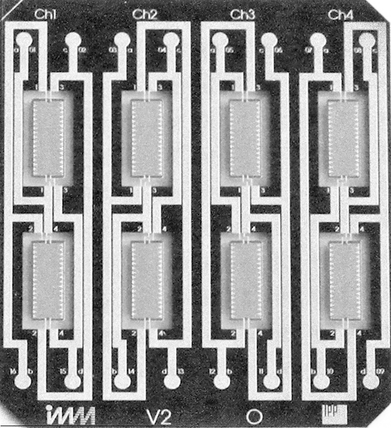
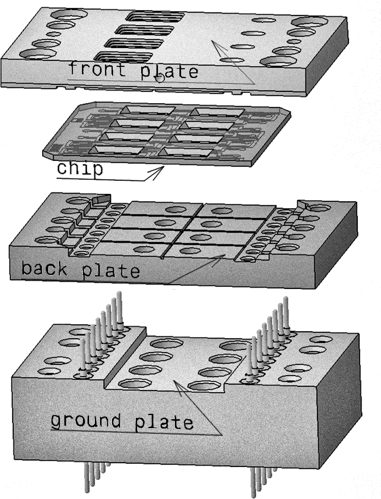

**Detector Specifications**:
- Absorber: 3.8×1.3 mm (5 mm²)
- Gold film: 5 μm thick
- Si front plate frame: 0.6 mm thick
- Si₃N₄ layer: 5 μm
- Aluminum layer: 150 nm (covers detector and frame)
- Carbon coat: 50 nm (on absorber area)
- Pt meanders: 1 kΩ (Wheatstone bridge connection)
- Secondary absorbers: Be or Al covered (soft X-ray analysis)

**Wheatstone Bridge Configuration**:
- 2 measurement + 2 reference absorbers per chip
- Reference absorbers shielded from radiation
- Pressure equilibration holes near reference foils
- Measurement and reference form bridge pairs

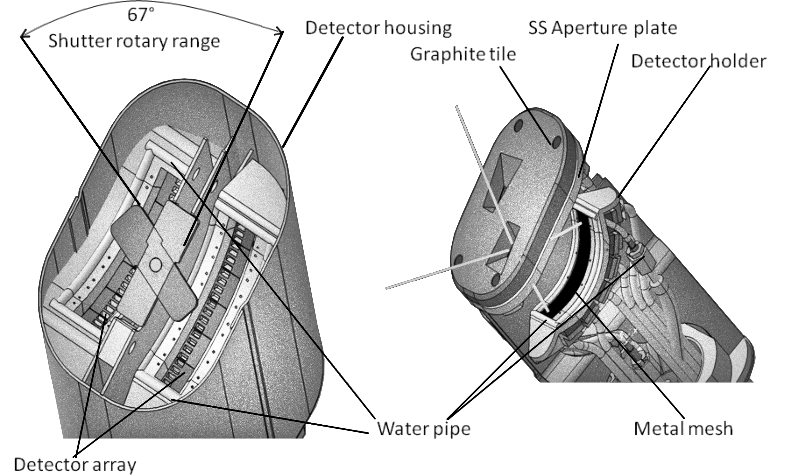

**Camera System**:
- Two cameras: Horizontal (HBC) and Vertical (VBC)
- Each camera: Multiple 32-channel detector arrays
- Graphite front plate with pinholes
- Rotary shutter for radiation blocking
- Water cooling via W7-X central system
- Pt100 thermometer for temperature monitoring

**Data Acquisition**:
- UHV-proof shielded cables: 40 m long
- LEMO® 10-pole connectors
- 4 master PCBs with 32 DAQ cards each
- ADC: AD7730 (National Instruments)
- NI 7813R FPGA controller
- LabVIEW software interface
- 128 total channels
- Local HDD + central W7-X archive storage

### Line of Sight Geometry

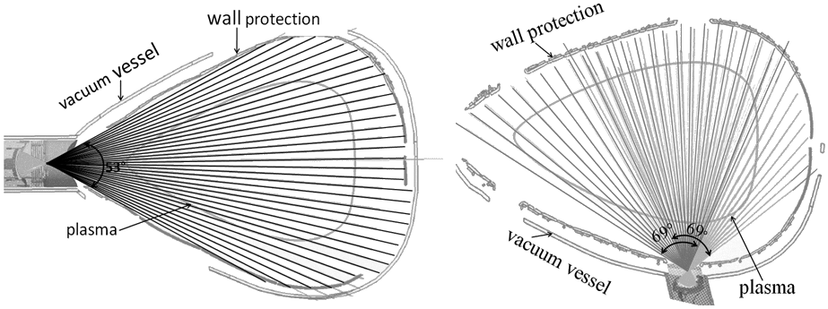

**Camera Positions**:
- Toroidal location: ~108° (triangular plane)
- HBC: Outer vessel side (horizontal view)
- VBC: Below vessel (vertical view)
- Toroidal tilt: 68.75° (intrinsic design)
- Toroidal LOS extension: ~5°

**Channel Configuration**:
- HBC: 32 channels (single array)
- VBC: 2×24 channels (overlapping at poloidal center)
- HBC: Full horizontal cross-section coverage
- VBC: Confined plasma area (not full SOL at bottom)
- Intersecting LOS enable tomographic inversion

**Geometric Parameters**:
- HBC aperture-detector distance: 175 mm
- VBC aperture-detector distance: 84 mm
- HBC pinhole: 5×10 mm (50 mm²)
- VBC: Two individual apertures (VBCl, VBCr)
- Viewing angles: HBC 138°, VBC 53°
- Detector arrangement: Fan/arch shape around pinholes


**Etendue (Light Yield)**:
- Equation: K̃_M = ∬ [cos(α)cos(β)/(4πd²)] dA_M dA_A
- α, β: Angles between LOS and normals
- d: Aperture-detector distance
- Accounts for partial detector shadowing
- W7-X design: d < a (detector smaller than aperture)


### Measurement Principle


**Wheatstone Bridge Operation**:
- Excitation voltage: U_ex = 5 V AC (adjustable kHz frequency)
- Balanced bridge: R_M = R_R = R, ΔU = 0
- Incident power → temperature rise → ΔR increase
- Bridge imbalance: ΔU/U_ex ≈ ΔR/(2R)
- AC excitation removes 1/f noise component
- Signal-to-noise doubled (both R_M respond simultaneously)

**Bolometer Equation**:
```
P_bol = (2Rκ)/(U_ex R̂τ) (ΔU + τ dΔU/dt)
```
Where:
- κ: Heat capacity
- τ: Cooling time
- R̂: Temperature coefficient of resistance
- ΔU: Bridge voltage imbalance


### Calibration Procedure


**In-Situ Ohmic Heating Method**:
1. Measure baseline current I₀ at floating potential
2. Apply U_cal = 1.2 V and 2.5 V for 1.6 s each
3. Measure current evolution I(t)
4. Calculate resistance: R_M = 2(U_cal/(I(∞)-I₀) - R_L - R_C)
5. Fit exponential decay: ΔI(t) = -ΔI(0)[1-exp(-t/τ_M)]
6. Extract cooling time τ_M and ΔI(0)
7. Calculate heat capacity: κ_M = ΔI⁴(0)/(4I(∞)(I(∞)-I₀))

**Cable/Load Parameters**:
- R_L = 10 Ω (load resistor)
- R_C = 40 Ω (cable resistance)

**Calibration Results** (OP1.2b campaign):
- Resistance: ~1 kΩ (very stable)
- Heat capacity: ~0.724 A² (5.45% deviation)
- Cooling time: ~110.57 ms (4.93 ms deviation)
- Offset: ~0.204 μV (31.11 μV deviation)


### Signal Processing

**Offset Correction**:
```
V_off = (1/(t₂-t₁)) ∫[t₁ to t₂] ΔU_M(t) dt
```
- Calculated from pre-plasma baseline

**Drift Correction** (Linear Least Squares):
```
V_drift(t) = β₁·t + β₂  (for t₁ < t < t₂)
           = 0          (elsewhere)
```
- Fits linear temperature drift
- Based on pre/post plasma signals

**Filtering**:
- Savitzky-Golay polynomial fit (order p, width N)
- Boxcar filter (moving mean, width N)
- Reduces derivative term noise contribution

**Final Bolometer Equation**:
```
P_M = F_M · (dΔŨ_M/dt + f_M ΔŨ_M)
```
Where:
- F_M = (2τ_M/V_eff)(R_M + 2R_C)κ_M√g_C
- f_M = f_τ/τ_M
- ΔŨ_M: Filtered, corrected voltage

### Performance Characteristics

**Spectral Response**:

- 5 μm gold absorber: Unity efficiency 600-0.2 nm
- Reflectivity reduced by carbon coating
- Sensitivity: 200 nW
- Absolutely calibrated measurements

**Microwave Protection**:

- Conductive wire mesh: 90 μm thickness, 0.24 mm spacing
- Ceramic TiO₂/Al₂O₃ coating on camera interior
- Cu-Be springs for tight front plate fit
- MISTRAL tests: <3% of 10 mW per detector
- Expected impact: 0.04 μW (orders below plasma radiation)

**ADC Specifications**:
- Range: ±80 mV (16-bit) → 2.44 μV resolution
- Minimum: ±10 mV → 0.31 μV resolution
- Master clock: 4.9152 MHz
- FPGA latency: 10-100 ns
- Sample times: {0.8, 1.6, 3.2, 6.4, 12.8} ms
- Noise: 0.5-6 μV
- SNR: >1000 (30 dB) in high radiation scenarios

**Operational Statistics** (OP1.2b):

- 61 functional detectors
- 1182 experiment programs
- Standard deviation: 0.5-1 μV
- Drift: 0.1-0.5 μV/s
- Gaussian error propagation: 1.599 μW

**Systematic Errors**:
- Temperature drift: 50-150 μV/K
- Pressure sensitivity: 2-8 W/m²/Pa (negligible at W7-X <0.01 Pa)
- Neutral gas charge exchange: Not corrected
- Grey body radiation from camera housing: ∝ εAΔT⁴

### Global Radiation Power


**Volumetric Estimation**:
- Irradiating volume: V_P,tor = 1.3²V_LCFS (EMC3-EIRENE simulations)
- Factor f_P = 1.69 (169% of LCFS volume)
- Covers magnetic islands and SOL
- r_eff extends to 1.35 r_a from magnetic axis

**Global Power Equation**:
```
P_rad = (V_P,tor/V_C) Σ_M (P_M V_M/K_M)
```
Where:
- V_M: LOS volume of channel M in radiation domain
- K_M: Etendue of channel M
- V_C: Total camera LOS volume
- C ∈ {HBC, VBC}


**Radiation Fraction**:
```
f_rad = P_rad/P_H
```
- P_H: Input heating power
- Target for DEMO: f_rad > 0.95


**Measurement Accuracy**:
- HBC and VBC typically agree within 5%
- Larger deviations in poloidally asymmetric scenarios
- Estimated error: 5% (comparison with other diagnostics)
- Potential vessel heat load contribution: +25% error

### Local Radiation Distribution

**2D Grid Construction**:

- Radial divisions: N_r (typically 20)
- Poloidal divisions: N_θ (typically 150)
- Toroidal extent: ±2.5° (accounts for camera tilt)
- Grid based on magnetic flux surfaces
- Pixel width: Δr = 1.3r_a/N_r
- Poloidal step: Δθ = 2π/N_θ

**Geometrical Contribution** (Local Sensitivity):
```
T^(i,j)_M = Σ_k T^(i,j,k)_M = Σ_k (∫_M L^(i,j,k)_M dK̃_M)
```
- Convolution of etendue and LOS length
- Describes radiation impact at position on absorber
- VBC etendue ~2× HBC (larger local sensitivity)

**Effective Plasma Radius**:

- Method (a): r_eff,M = argmin(r_eff^(i,j)) for T^(i,j)_M > 0
- Method (b): Weighted average by T_M^(i,j)
- Sign convention distinguishes outboard/inboard

**Chord Brightness Profile**:
```
P_chord,M = P_M / Σ_i,j,k T_M^(i,j,k)
```
- Average power per volume along LOS
- Combined with r_eff,M for radial profiles


### Tomographic Inversion

**Mathematical Framework**:
- **Radon Transform**: ℛf_L = ∫_L f(x,y) dL
- **Filtered Back-Projection**: Convolution with highpass filter h(r)
- **Fourier Domain**: f(r,θ) = ∫₀^π ℱ⁻¹(ℱℛf_L(ω)||ω||k(ω)) dθ

**Ill-Posed Problem**:
- Free parameters (pixels) >> constraints (LOS)
- Requires regularization algorithms
- **Tikhonov Regularization**:
  ```
  η = x^(μ) = (T^T T + μ⁻¹I)⁻¹ T^T b
  min ||（b-Tη)^T(b-Tη) + μ(η^Tη - c^(μ))||
  ```
- μ: Regularization parameter
- Stronger regularization → closer to desired solution, larger error

**Minimum Fisher Regularization**:
- Currently used at W7-X
- Detailed in Chapter 4

**Radial and Poloidal Profiles**:
```
ĝ_rad(r) = (1/2π) ∫₀^2π ĝ(r,θ) dθ
ĝ_pol(θ) = (1/f_P r_a) ∫₀^(f_P r_a) ĝ(r,θ) dr
```


### Power Balance

**0-D Energy Conservation**:
```
0 = P_bal = P_ECRH - P_rad - P_div - dW/dt
```

**Components**:
- **P_ECRH**: Microwave heating input (±10% error)
- **P_rad**: Bolometer radiation measurement (±5% error, potential +25% vessel contribution)
- **P_div**: Divertor target heat load from IR thermography (±10% error)
  - THEODOR code for heat transport analysis
- **W**: Plasma stored energy
  - W_kin: From density/temperature profiles (analytical, +25% vs W_dia)
  - W_dia: From diamagnetic loops (preferred, more accurate)


**Observations**:
- Generally P_bal ≈ 0 within error bars
- Large error bars from uncertainty propagation
- Discrepancies in fast transient scenarios
- Better representation in steady-state conditions
- Excess heating power at discharge start
- Radiation peaks after shut-off
- Volumetric estimation errors in shrinking plasma scenarios

---


## Chapter 2: Plasma Radiation Feedback Control

### Real-Time Radiation Feedback System Configuration

#### System Components
- **Thermal Helium Beam Diagnostic**: Gas injection actuator for feedback control
  - Fast-acting thermal gas valves
  - Hydrogen seeding into scrape-off layer (SOL)
  - Located in various half modules (e.g., AEH31, AEH51)
  - Flow rates: 6×10¹⁸ atoms/s at 50 mbar
  - Reservoir pressures: 50-750 mbar


- **Dispersion Interferometer**: Line-integrated electron density measurement
  - Alternative feedback candidate
  - Lower latency than bolometry
  
- **Filterscopes**: C-III (C²⁺) radiation measurement
  - Lines of sight parallel to horizontal divertors
  - Measures ionization radiation in front of targets
  - Third feedback candidate


#### PID Controller Implementation
- **Control Equation**: u(t) = K_p·e(t) + K_i·∫e(t)dt + K_d·de(t)/dt
- **Components**:
  - K_p: Proportional gain (immediate response to error)
  - K_i: Integral gain (accumulated error compensation)
  - K_d: Differential gain (rate of change response)
- **Process Value**: y(t) = P_pred^(n) (radiation proxy)
- **Setpoint**: SP = target radiation fraction (typically f_rad ≥ 90%)
- **Error**: e(t) = SP - y(t)


### Real-Time Radiation Proxies

#### Proxy 1: Multi-Channel Prediction
**Equation**: P_pred^(1) = (V_P,tor/V_C) Σ_{M∈S} (a_M ΔŨ_M V_M/K_M)

- Uses subset S of bolometer channels
- Requires pre-calculated geometry factors (a_M, V_M, K_M)
- Assumes radiation distribution can be extrapolated from subset
- Limited flexibility due to pre-computed magnetic configuration

#### Proxy 2: Single-Channel Approximation
**Equation**: P_pred^(2) = a_M ΔŨ_M

- Based on single absorber measurement
- Eliminates time derivative requirement
- Faster computation, reduced complexity
- Higher noise sensitivity

#### Algorithm Features
- **FIFO Array**: M-sample smoothing (typically M=10)
- **Latency**: Minimum 13.6 ms for Δt = 1.6 ms sample time
- **Additional Delay**: ~M·Δt/2 from FIFO smoothing
- **Total System Latency**: 200-400 ms including plasma response

### Performance Benchmarking

#### Acquisition Timing Tests


**Without Real-Time Feedback**:
- Δt = 0.8 ms: 6.25% timing error (erratic behavior)
- Δt = 1.6 ms: Small perturbations, three discrete values
- Δt = 3.2 ms: Within error bars, acceptable performance
- Random perturbations in both directions around set value


**With Real-Time Feedback**:
- Δt = 0.8 ms: Linear increase 0.01 ms/s, doubles after 60s
- Δt = 1.0 ms: Elongation after ~28,000 samples
- Δt = 1.6 ms: Acceptable with minor deviations
- Larger sample times: No perturbations


**CPU Load Test**:
- 80% synthetic CPU load applied
- No noticeable difference in timing performance
- Computational stress has no effect on acquisition

**Conclusion**: Real-time feedback not applicable for Δt < 1.6 ms or experiments > 30s at higher frequencies

### Experimental Achievements

#### Initial Results: XP20180920.29


**Configuration**:
- First radiation feedback controlled discharge
- Post-boronization (6× reduction in O, C line radiation)
- 2 MW X2-mode ECRH (terminated early at 1.3s)
- Channel subset: S = {0, 3, 7, 14, 16} (HBC)
- Target: f_rad = 90%
- Hydrogen pre-fill: 5× 5ms bursts at 200 mbar·L/s

**Results**:
- **Failure**: Radiative collapse due to proxy underestimation
- P_pred^(1) underestimated P_rad by >10%
- Two gas injections triggered
- f_rad exceeded 95%, causing density collapse
- Core density peaked while edge collapsed
- Plasma became transparent to microwaves
- Discharge terminated early


**Key Findings**:
- Radiation mainly inside LCFS (r_eff ∈ [-1, 1])
- Strong hollowness in VBC profile (~50%)
- Asymmetry connected to gas injection location
- Channel 0 malfunctioned (high noise)
- Need optimized channel selection for feedback

#### Application Progress: XP20180920.31


**Configuration**:
- 10s discharge, 2.9 MW X2-mode ECRH
- Same channel subset S = {0, 3, 7, 14, 16}
- Variable K_p = f(e(t)) implemented
- Net toroidal current: ~2 kA counter-clockwise

**Results**:
- Full 10s discharge achieved
- VBC measured 10% more P_rad than HBC
- P_pred^(1) ~10% less than P_rad,HBC
- Oscillations in f_rad due to valve cycling
- Electron density: 7.5-4×10¹⁹ m⁻³ (decreasing outward)
- Electron temperature: Peak 5.5 keV (core), <1 keV (edge)
- f_rad ~75% achieved but not sustained


**Limitations**:
- Conservative K_i unable to maintain high f_rad
- Large gaps between gas injections
- Radiation fraction dropped between valve activations
- K_d (differential component) difficult to optimize
- Did not achieve stable detachment

#### Successful Detachment: XP20181010.32


**Configuration**:
- 9.2s discharge, 6.23 MW O2-mode ECRH
- Total input energy: 55 MJ
- **Optimized channel subset**: S = {65, 78, 61, 73, 86} (VBC only)
- Channels cover magnetic islands, X-points, core region
- Hydrogen seeding at 750 mbar
- Net toroidal current: ~0.9 kA counter-clockwise

**Key Achievement**: **STABLE PLASMA DETACHMENT**

**Results**:
- **f_rad > 90%** maintained for extended duration
- **P_div reduced by factor >2** at f_rad ≥ 90%
- No degradation of W_dia (plasma stored energy)
- Core n_e stable, no collapse
- Radiation condensation at X-points and magnetic islands
- Emissivity factor 2-3× higher in islands vs core
- Maximum chord brightness: 400 kW/m³


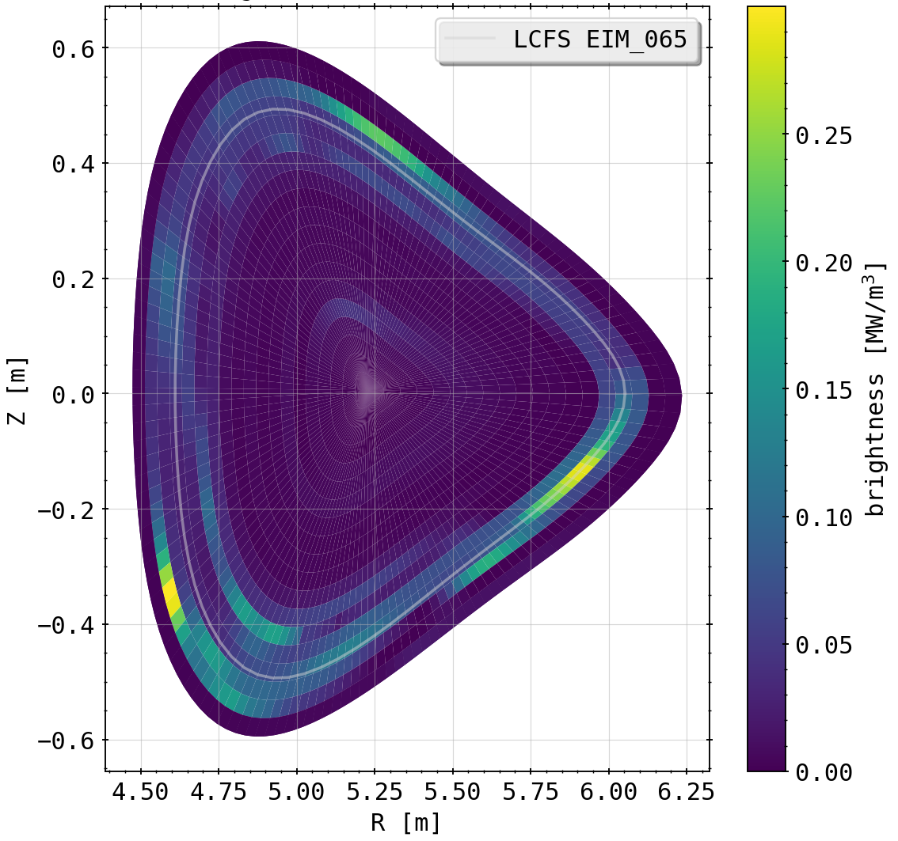


**Plasma Behavior**:
- Inward radiation shift at f_rad > 70%
- Edge n_e decreased ~30% during f_rad oscillations (90-100%)
- T_e inversely coupled to f_rad (stronger than n_e)
- Steepening of density profile at high f_rad
- Flattening of temperature profile
- Reduced perpendicular transport to SOL

**Limitations**:
- Oscillations in P_rad (±10% of P_H) due to valve cycling
- P_pred^(1) consistently overestimated P_rad
- Latency issues: 200-400 ms plasma response delay
- K_i not optimized for steady-state operation

### Comparison to Alternative Feedback Methods

#### Electron Density Feedback: XP20181016.16


**Configuration**:
- 21s discharge, 5 MW O2-mode ECRH (stepped)
- Feedback on line-integrated n_e from dispersion interferometer
- Setpoint: n_e ramp ~1.1×10²⁰ m⁻³ (declining)
- Same valve location (AEH51)

**Results**:
- **f_rad = 80-90%** achieved and maintained
- **P_div reduced by 50%** at f_rad > 80%
- **No oscillations** (smoother than radiation feedback)
- Lower latency coupling to feedback proxy
- More reliable, steady-state performance
- Requires prior exploration of n_e setpoint


**Comparison**:
- Similar chord brightness profiles to XP20181010.32
- Poloidal asymmetry with peaks at r_eff = r_a, 0.8r_a
- P_rad ~0.5 MW lower than radiation feedback case
- Maximum chord brightness 15-20% lower
- Gradual P_rad increase compensated by n_e ramp-down

#### C-III Filterscope Feedback: XP20180920.32


**Configuration**:
- 9.5s discharge, 3 MW X2-mode ECRH
- Feedback on C²⁺ line radiation from filterscopes
- Lines of sight parallel to divertor HM51
- Setpoint: Increase C²⁺ emission away from target (AEI30)
- Goal: Shift ionization front, detach from target

**Results**:
- **f_rad = 70%** maximum (lower than other methods)
- C²⁺ radiation shifted from target to plasma side
- Residual emission near divertor (not fully detached)
- Smoother control (K_i dominated, optimized PID)
- Lower latency, higher temporal resolution
- Different heating mode limits direct comparison


**C²⁺ Radiation Evolution**:
- XP20181010.32: Detachment at f_rad > 80%, no emission near target at f_rad > 70%
- XP20180920.32: Shift to plasma side but incomplete detachment
- Factor 2-3× reduction in C²⁺ emission at f_rad ≈ 50%

### Conclusions

#### Achievements
1. **Stable plasma detachment demonstrated** (XP20181010.32)
2. **f_rad > 90%** maintained with feedback control
3. **Target heat load reduced by factor >2**
4. **Real-time radiation proxies validated** for feedback applications
5. **Minimum latency 13.6 ms** for Δt = 1.6 ms

#### Limitations
1. **Large system latency**: 200-400 ms total (measurement + plasma response)
2. **Sample time restrictions**: Δt ≥ 1.6 ms required for stable operation
3. **Oscillations in P_rad**: ±10% due to valve cycling and latency
4. **Channel selection critical**: VBC channels viewing islands/X-points optimal
5. **PID optimization challenging**: Limited experimental opportunities

#### Comparison Summary
| Method | f_rad | Latency | Oscillations | Advantages | Disadvantages |
|--------|-------|---------|--------------|------------|---------------|
| **Radiation** | >90% | High (200-400ms) | Yes (±10%) | Direct detachment metric, no prior exploration | Large latency, oscillations |
| **Density** | 80-90% | Medium | No | Smooth, reliable, lower latency | Requires setpoint exploration |
| **C-III** | ~70% | Low | No | Lowest latency, smooth | Lower f_rad, heating mode dependent |

#### Future Improvements
1. Optimize PID parameters (K_p, K_i, K_d) for steady-state
2. Reduce feedback latency through algorithm optimization
3. Implement blind absorber for latency disentanglement
4. Explore f_rad as direct control parameter (vs P_rad)
5. Adapt to variable heating power scenarios
6. Long-term steady-state experiments planned

**Key Insight**: Real-time radiation feedback successfully achieves stable detachment but requires careful optimization of channel selection, PID parameters, and sample timing to overcome inherent latency challenges.


## Chapter 3: Feedback Impact and Line of Sight Sensitivity Analysis

### Research Questions
1. Does an optimal set of lines of sight S exist for real-time bolometer feedback?
2. What is the dominant contributor to LOS selection sensitivity?

### Impurity Seeding Modelling

#### Two-Chamber Model


**Model Equations**:
```
dN_p/dt = Γ_s + N_w·τ_w,p - N_w,lim·τ_w,p·N_p - N_p·τ_p
dN_w/dt = (N_w,lim - N_w)·τ_w,p
```

**Key Parameters**:
- N_p: Plasma chamber population
- N_w: Wall chamber population  
- Γ_s: Gas injection rate
- τ_w,p, τ_p: Transport/loss rates
- N_w,lim: Wall chamber capacity limit


**Results**:
- Successfully reproduces experimental P_rad behavior
- Assumes P_rad ∝ N_p (direct proportionality)
- Wall chamber has small positive slope
- Model explains saturation in radiation power during gas injection
- Fit parameters: Γ_s = 0.648 a.u./s, τ_w,p = 0.1 a.u./s, N_w,lim = 1.388 a.u.

#### Three-Chamber Model


**Extended Model**:
- Adds scrape-off layer (SOL) chamber N_s between plasma and wall
- Gas injection into SOL (more realistic)
- Finite capacity limits for plasma and wall chambers

**Equations**:
```
dN_w/dt = (N_w,lim - N_w)·τ_w,s
dN_s/dt = Γ_s + (N_p·N_s·τ_s,p)/N_p,lim - N_w,lim·τ_w,s - N_s·(τ_s,p + τ_s)
dN_p/dt = N_s·τ_s,p - (N_p·N_s·τ_s,p)/N_p,lim
```


**Results**:
- P_rad ∝ N_p + f·N_s (weighting factor f ≈ 11)
- SOL population dominates radiation contribution (10× larger than N_p)
- Wall chamber content negligible (100× smaller)
- Strong correlation between SOL impurity content and P_rad
- Consistent with C-III emission measurements showing edge radiation accumulation

**Conclusion**: SOL impurity seeding is primary driver of radiation power loss in feedback experiments

### Line of Sight Sensitivity Evaluation

#### Evaluation Methodology

**Metric Framework**:
```
φ = f(t, S, P_rad): Quality metric in time domain
θ = h(S, P_rad, φ): Map to single quality value
```

**LOS Selection Strategy**:
- Test combinations of 3, 5, and 7 channels
- Permutations from HBC and VBC separately
- 900 different sets S for m=3 channels
- Applied to all feedback experiments

**Average Sensitivity**:
```
θ̄_n^(m) = (1/N^(n,m)) Σ_S θ(S^(m))
```

#### Metric 1: Weighted Deviation

**Definition**:
```
φ(t) = 1 - |P_pred - P_rad|/P_rad  (if |P_pred - P_rad| < P_pred)
θ = (1/(T_stop - T_start)) ∫ φ(t) dt
```


**Results**:
- **HBC**: Average quality 0.7-0.92 depending on m
  - m=3: ~0.8 average, higher at ±0.5r_a (up to 0.9)
  - m=5: 0.84-0.9 average
  - m=7: 0.91-0.92 average (narrowest spectrum)
  - Local minimum at channel 20 (X-point): 0.58
  - Quality increases with selection size m

- **VBC**: Average quality >0.75 for all m
  - Higher sensitivities at r ~ -0.5r_a and -0.1r_a
  - No correlation between m and average sensitivity
  - Larger uncertainties (up to 20% for some channels)
  - Gap in spectrum around -0.36r_a

**Key Finding**: LOS viewing separatrix and opposite magnetic island show highest sensitivity

#### Metric 2: Correlation

**Definition**:
```
φ(t) = ∫ P_pred(τ)·P_rad(t+τ) dτ  (cross-correlation)
θ = (1/(T_stop - T_start)) ∫ |φ*(t) - φ(t)| dt
```


**Results**:
- Very large error bars (up to 40%)
- Congruent profiles for different m
- **Opposite findings to weighted deviation**:
  - Lowest sensitivity at ±0.9r_a (previously highest)
  - LOS viewing X-points show poor temporal correlation
  - Emphasizes discrepancies from localized gas puff perturbations

**Interpretation**: Correlation metric penalizes channels sensitive to localized radiation changes from feedback

#### Metric 3: Mean Deviation

**Definition**:
```
φ(t) = (1/(T_stop - T_start))·(P_rad(t) - P_pred(t))²
θ = √((T_stop - T_start)·(∫ φ(t) dt)^(-1))
```


**Results**:
- Similar to weighted deviation but less pronounced extrema
- Large error bars (20-40%)
- Quality scales with m (m=7 highest)
- Local extrema at same locations as weighted deviation
- No outliers in local sensitivity

**Overall Conclusions**:
1. **Optimal LOS**: Channels viewing separatrix and SOL most promising
2. **Avoid**: Core-viewing and outermost edge channels less favorable
3. **Selection size**: m=7 makes biases obsolete, any combination works well
4. **Best regions**: Upper inboard magnetic island and X-points (VBC)
5. **Prediction accuracy**: ≥70% for m≥3, ≥85% for optimized selections

### STRAHL Impurity Transport Modelling

#### Model Description
- One-dimensional radial impurity transport code
- Solves continuity equation for each ionization stage
- Anomalous diffusion + convective drift ansatz
- Neoclassical transport via NeoArt or Hirshman-Sigmar approximations

**Radial Transport Equation**:
```
∂n_i,Z/∂t = (1/r)·∂/∂r[r(D*·∂n_i,Z/∂r - v*·n_i,Z)] + S_i,Z
```

**Flux Surface Averaged Coefficients**:
```
D* = ⟨D(θ)|∇r|²⟩_FS
v* = ⟨v(θ)|∇r|⟩_FS
```

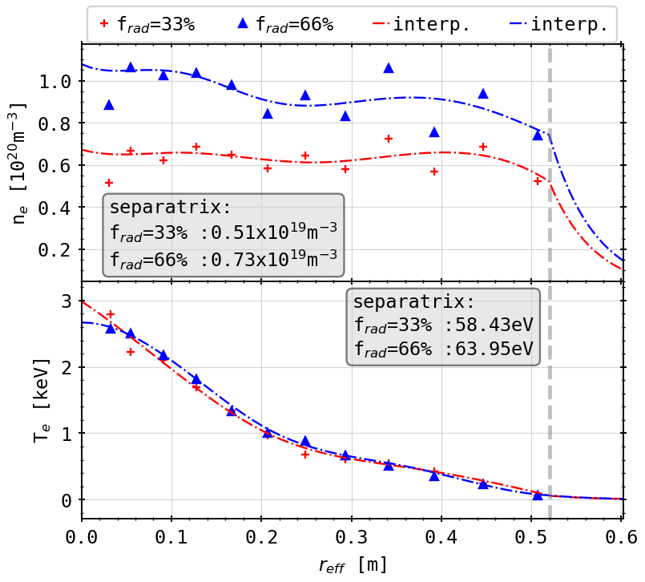


#### Key Findings (XP20181010.32 Analysis)

**Carbon vs Oxygen**:
- Carbon radiation 10¹-10² times larger than oxygen
- Oxygen negligible after boronization
- Focus on carbon for analysis

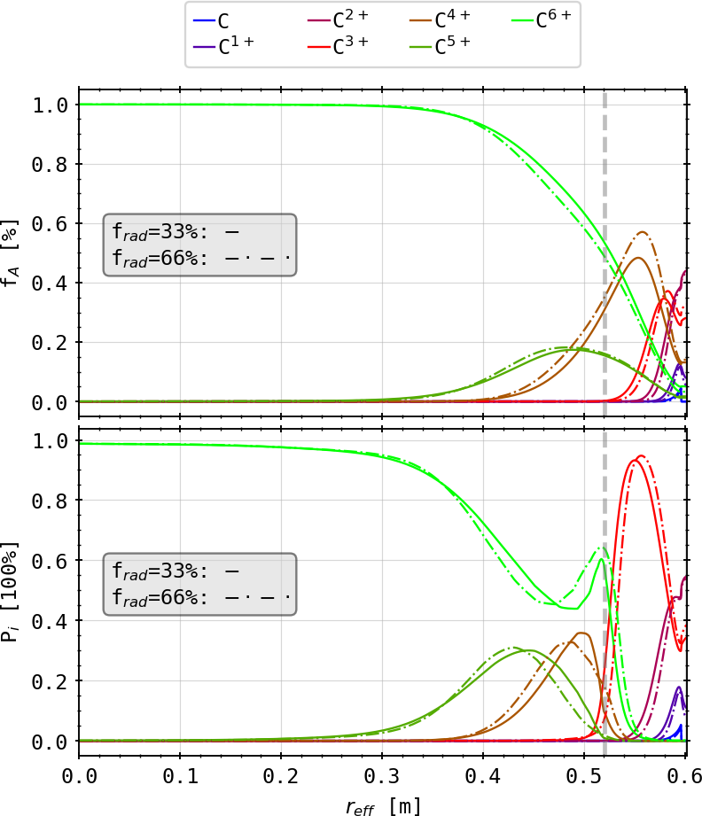

**Carbon Ionization Stages**:
- C⁶⁺ (fully ionized) dominates core up to 0.6r_a
- C⁵⁺, C⁴⁺ increase toward separatrix
- Lower stages appear in SOL
- Neutral carbon only at domain edge (recombination at target)

**Radiation Distribution**:
- f_rad = 33%: Peak at 0.8r_a (oxygen), 45 kW/m³ beyond LCFS (carbon)
- f_rad = 66%: Linear scaling (factor 2 increase)
- Carbon minimum at LCFS, maximum in SOL
- Oxygen peak inside separatrix

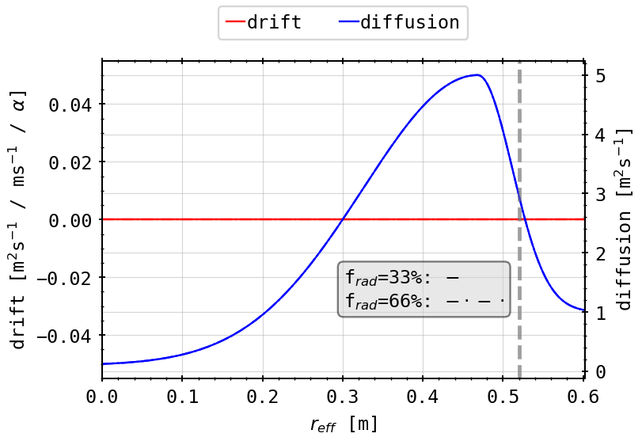

**Transport Characteristics**:
- Anomalous diffusion >> neoclassical (factor 10²)
- Turbulent transport dominant
- Larger diffusivity in core toward separatrix
- Convective drift kept at zero (not well understood)

#### Parameter Variations

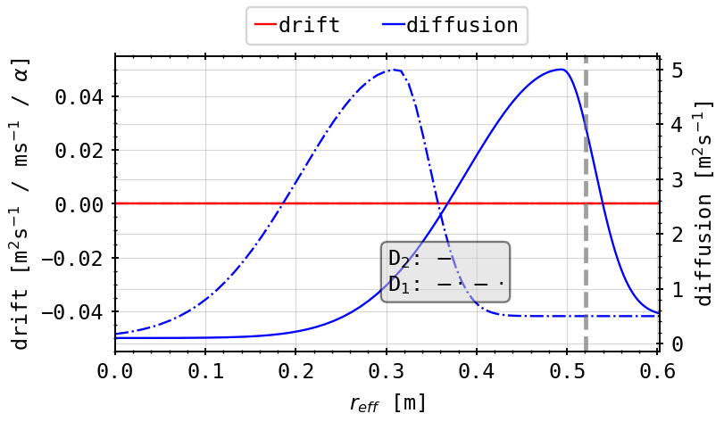
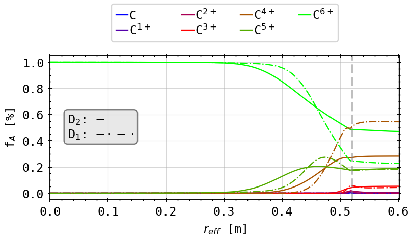

**Diffusion Coefficient Impact**:
- Reduced D shifts radiation inward
- Lower D increases core emissivity
- Affects ionization stage distribution

**Temperature/Density Impact**:
- Lower T_e, n_e at separatrix shifts radiation inward
- Consistent with experimental observations at high f_rad
- Supports detachment physics understanding

**Limitations**:
- Poor accuracy outside LCFS (SOL)
- Parallel transport approximated by loss time τ_||
- Kinetic profiles decay exponentially in SOL
- Cannot reproduce experimental chord brightness asymmetry
- Suggests model ansatz discrepancies

**Conclusion**: STRAHL qualitatively reproduces inward radiation shift at high f_rad but lacks quantitative agreement with experimental asymmetries

---

## Chapter 4: Two-Dimensional Radiation Inversion

### Tomographic Reconstruction Challenge
- Ill-posed problem: n_pixels >> n_LOS (free parameters >> constraints)
- Requires regularization for stable solution
- Tikhonov regularization with functional K and factor μ

**Regularization Balance**:
- μ → 0: Solution dominated by measurement geometry
- μ → ∞: Solution adheres to regularization functional K

### Minimum Fisher Regularisation (MFR)

#### Fisher Information Concept
**Definition**:
```
I_F = ∫ (1/g(r))·(∂g(r)/∂r)² dr
```

- g(r): Probability density distribution (emissivity)
- I_F: Information content about characteristic in r
- Cramér-Rao bound: σ_g ≥ 1/I_F

**Properties**:
- Minimum Fisher information → maximum variance → smoothest solution
- Robust toward noisy data
- Suited for smooth (not peaked) distributions
- Cannot resolve poloidally varying SOL emissivity

#### MFR Algorithm

**Iterative Regularization**:
```
H^(n) = ∇_x^T·W^(n)·∇_x + ∇_y^T·W^(n)·∇_y
```

**Weighting Matrix**:
```
n=0: W^(0) = I (identity matrix)
n≥1: W^(n)_i,j = (1/g_i^(n-1))·δ_i,j  (if g_i^(n-1) > 0)
              = W_max·δ_i,j         (if g_i^(n-1) ≤ 0)
```

**Iteration Formula**:
```
x^(n+1) = (T^T·T + μ·H^(n))^(-1)·T^T·b
```

**Termination Criteria**:
```
χ² ≤ χ²_min
||x^(n) - x^(n-1)|| ≤ σ_min
```

**Computational Implementation**:
- SuperLU library for matrix inversion (most costly operation)
- Discrete differential operators in cylindrical coordinates (r, θ)
- Flux surface averaging for smoothness

### Radially Dependent Anisotropy (RDA)

#### Motivation
- Exploit a priori knowledge of radiation distribution
- Allow localized structures (X-points, islands) while maintaining smoothness
- Radially varying poloidal smoothness constraint

#### Anisotropy Factor

**Definition**:
```
k_ani^(i) = f(i, N_T, N_S, k_core, k_edge)
```


**Parameters**:
- N_T: Target radial bin (transition location, typically at separatrix)
- N_S: Transition width (smoothness of change)
- k_core: Core anisotropy weight
- k_edge: Edge anisotropy weight

**Modified Regularization**:
```
K_ani = (1/k_ani)·I
∇̂_θ = K_ani·∇̃_θ
H^(n)_ani = ∇_r^T·W^(n)·∇_r + ∇̂_θ^T·W^(n)·∇̂_θ
```

**Design Principles**:
- Radial operator ∇_r unchanged (maintain robustness)
- Only poloidal operator weighted
- k < 1: Favor localized structures
- k > 1: Favor smooth distributions
- Smooth transition at separatrix

### Camera Geometry Sensitivity

#### Etendue Calculation

**Discrete Formulation**:
```
T^(i,j)_M = Σ_k Σ_(p,q) L^(i,j,k)_(p,q)·(cos(α)cos(β)/(2πd²))·dA_M·dA_A
```

**Components**:
- L^(i,j,k)_(p,q): LOS section length in voxel v^(i,j,k)
- α, β: Incident angles at absorber and aperture
- d: Distance between differential elements
- dA_M, dA_A: Differential absorber and aperture areas

#### Absorber/Aperture Segmentation


**Methods Compared**:
1. **Rectangular Interpolation**: Equal-sized subdivisions, uneven center distribution
2. **Delaunay Triangulation**: Unequal triangles, uniform center distribution

**Segmentation Levels**: N ∈ {2, 4, 8} subdivisions


**Results**:
- N=2: Spatial discrepancy > Δφ·Δθ·r_a at opposite torus
- N=8: Discrepancy < (1/2)Δφ·Δθ·r_a
- Neighboring LOS cones: No gaps, no overlap
- Triangulation provides more uniform coverage


**Validation**:
- Both methods qualitatively agree for N≥5
- Triangulation N≥5 required for validity
- Spatial resolution at magnetic axis: 5 cm
- Good poloidal LOS coverage (no voids)

### Key Findings

**MFR Performance**:
- Robust and reliable for W7-X bolometer system
- Sensitive to LOS geometry perturbations
- Intrinsic bias toward upper SOL/separatrix in T matrix
- Quality depends on input data preparation and noise level

**RDA Enhancement**:
- Allows detection of localized radiation structures
- Maintains overall smoothness
- No single optimal k_ani set (high-dimensional optimization)
- k < 1 for localized, k > 1 for smooth features

**Geometry Sensitivity**:
- Accurate T matrix critical for reconstruction quality
- N=8 segmentation provides good balance
- Triangulation preferred for uniform coverage
- Minor HBC asymmetry not visible in etendue

**Limitations**:
- Cannot resolve poloidal SOL variations
- P_rad from tomography underestimates total power
- χ² not always indicative of optimal reconstruction
- Computationally expensive (matrix inversion)

---

## Chapter 5: Conclusion and Outlook

### Major Achievements

#### Real-Time Radiation Feedback System
**Success Metrics**:
- Stable hydrogen plasma with controlled helium edge cooling
- **f_rad ≥ 85%** achieved (peak 100%)
- **Target heat load reduced by factor ≥2**
- C³⁺ detachment visible at f_rad ~ 50%
- Minimum 3 LOS validated as proxy for P_rad

**System Characteristics**:
- Fast radiation power loss extrapolations
- Comparison with single detector raw signals successful
- Validated for steady-state scenarios

**Limitations**:
- Non-negligible latency (computational + algorithmic)
- Difficult to optimize during commissioning
- Larger latency than alternative feedback candidates (n_e, C-III)

#### Line of Sight Sensitivity Analysis
**Key Results**:
- Detectors viewing **separatrix and SOL** most viable for feedback
- No single "best" set of 3/5/7 detectors
- Robust selections achieve **≥85% prediction accuracy**
- Agreement between HBC and VBC analyses
- Both radiation and plasma parameter analyses consistent

**Optimal Configuration**:
- Vertical and/or horizontal camera channels
- Focus on separatrix region
- Avoid extreme core or edge channels

#### Impurity Seeding Models
**Two/Three-Chamber Models**:
- Both equally capable of representing experimental P_rad
- Three-chamber model more realistic (SOL inclusion)
- SOL population dominates radiation contribution
- Parameters provide limited additional insight
- Promising outlook for future optimization

**STRAHL Simulations**:
- Carbon dominant contributor to SOL emissivity
- Reduced diffusivity shifts radiation inward
- Lower T_e, n_e at separatrix consistent with experiments
- Inward shift observed for f_rad → 1
- **Limitation**: Cannot reproduce experimental chord brightness asymmetry

#### Tomographic Reconstruction
**MFR with RDA**:
- Significant robustness and reliability established
- Rigorous geometry perturbation testing completed
- Intrinsic bias toward upper SOL/separatrix identified
- No single optimal k_ani set (high-dimensional problem)

**Phantom Benchmarking**:
- k < 1 corresponds to localized structures
- k > 1 corresponds to smooth distributions
- χ² not always indicative of optimal reconstruction
- P_rad consistently underestimates total phantom power

**Experimental Application**:
- Results consistent with benchmark
- Stable alternative to P_rad for power balance
- Computationally costly

### Future Directions

#### Feedback System Improvements
1. **Latency Reduction**:
   - Computational upgrades
   - Algorithm optimization
   - Enable per-experiment configurability

2. **Enhanced Prediction Models**:
   - More complex P_pred incorporating operational parameters
   - Scaling law development
   - Predictive component addition

3. **Multi-Channel Analysis**:
   - Correlation between P_pred^(1) (multi-channel) and P_pred^(2) (single signal)
   - Focus on derivative character
   - Volumetric scaling investigation

#### Model Development
1. **Chamber Models**:
   - Educated parametric optimization
   - Integration with other SOL models
   - Better population/transport regime understanding

2. **STRAHL Extensions**:
   - Improved SOL treatment
   - Better asymmetry reproduction
   - Enhanced transport coefficient models

#### Tomography Enhancement
1. **Phantom Benchmarking**:
   - Larger set of relevant phantom images
   - Supplementary artificial camera locations
   - Extended principle brightness profile shapes

2. **Camera Extension**:
   - Practical extension candidates identified
   - Confidence improvement for measured data
   - Broader coverage of profile combinations

### Critical Insights

**Radiation Feedback**:
- Essential for future fusion reactors (DEMO)
- f_rad ≥ 95% necessary for reliable operation
- Direct connection to detachment process
- Intrinsic P_rad/f_rad link makes approach essential

**System Integration**:
- Moderate gas puffs (medium length/intensity) most reliable
- Avoid terminal plasma perturbation
- Balance between cooling and stability

**Measurement Quality**:
- Accurate geometry critical for tomography
- Input data preparation more important than χ² minimization
- Multi-metric evaluation necessary for LOS selection

**Operational Readiness**:
- System proven successful for stable detachment
- Ready for upcoming experimental campaigns
- Assumptions about radiation distribution remain valid
- Further optimization possible with upgraded hardware
